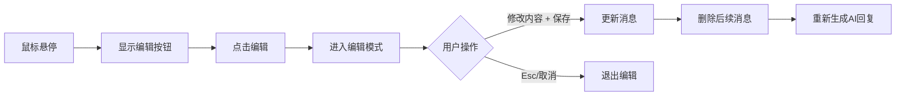
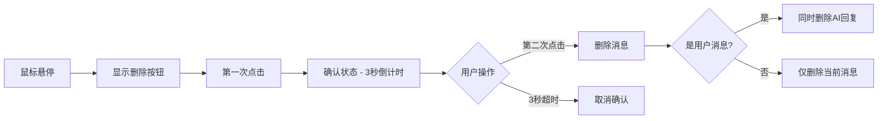

# ✅ 消息编辑与管理功能实现完成

**完成时间**: 2025-10-29  
**功能模块**: AI 对话界面 - 消息编辑与管理

---

## 🎯 实现的功能

### 1. ✏️ 编辑消息
- **触发方式**: 鼠标悬停在用户消息上,点击左侧编辑按钮
- **编辑界面**: 
  - 消息转换为可编辑文本框
  - 边框高亮为品牌橙色
  - 自动调整文本框高度 (最大 200px)
- **保存操作**:
  - "保存并重新生成" 按钮
  - 快捷键: `Ctrl/Cmd + Enter`
  - 自动删除该消息之后的所有回复
  - 自动重新生成 AI 回复
- **取消操作**:
  - "取消" 按钮
  - 快捷键: `Esc`

### 2. 🗑️ 删除消息
- **触发方式**: 鼠标悬停在用户消息上,点击左侧删除按钮
- **确认机制**:
  - 首次点击: 按钮变为脉冲红色 + "确认删除?" 提示
  - 二次点击: 确认删除
  - 3秒后自动取消确认状态
- **智能删除**:
  - 删除用户消息时,自动删除后面的 AI 回复
  - 保持对话连贯性

### 3. 🔄 重新生成 (已有功能)
- AI 消息下方的"重新生成"按钮
- 使用相同的用户输入重新请求

---

## 💻 技术实现

### 组件修改

#### 1. **notion-ai-interface.tsx** (状态管理层)
```typescript
// 新增函数
const handleDeleteMessage = (messageId: string) => {
  // 删除消息,如果是用户消息则连同 AI 回复一起删除
}

const handleEditMessage = async (messageId: string, newContent: string) => {
  // 更新消息内容,删除之后的消息,重新生成 AI 回复
}
```

**传递给子组件**:
```tsx
<AIChatState 
  onDeleteMessage={handleDeleteMessage}
  onEditMessage={handleEditMessage}
/>
```

#### 2. **ai-chat-state.tsx** (UI 层)
```typescript
// 新增状态
const [editingMessageId, setEditingMessageId] = useState<string | null>(null);
const [editingContent, setEditingContent] = useState('');
const [deleteConfirmId, setDeleteConfirmId] = useState<string | null>(null);
const editTextareaRef = useRef<HTMLTextAreaElement>(null);

// 新增函数
handleStartEdit()      // 开始编辑
handleCancelEdit()     // 取消编辑
handleSaveEdit()       // 保存编辑
handleDeleteClick()    // 首次点击删除
handleConfirmDelete()  // 确认删除
```

**新增图标**:
- `Edit2` - 编辑按钮
- `Trash2` - 删除按钮
- `X` - 取消按钮
- `Check` - 确认按钮

---

## 🎨 UI/UX 设计

### 用户消息布局
```
┌──────────────────────────────────┐
│  [编辑] [删除]    用户消息气泡    │ ← 鼠标悬停显示左侧按钮
└──────────────────────────────────┘
```

### 编辑模式
```
┌─────────────────────────────────────┐
│  ╔═══════════════════════════════╗  │ ← 橙色边框高亮
│  ║ [可编辑文本框]                 ║  │
│  ║                                ║  │
│  ╚═══════════════════════════════╝  │
│  ────────────────────────────────   │
│              [取消] [保存并重新生成] │
│  Ctrl+Enter 保存 • Esc 取消         │
└─────────────────────────────────────┘
```

### 删除确认
```
第一次点击:
[🗑️] ← 普通状态

第二次点击 (3秒内):
[🗑️] ← 脉冲红色 + "确认删除?" 提示
```

---

## 📊 交互流程

### 编辑流程


### 删除流程


---

## ⌨️ 键盘快捷键

| 快捷键 | 功能 | 作用域 |
|--------|------|--------|
| `Ctrl/Cmd + Enter` | 保存编辑 | 编辑模式 |
| `Esc` | 取消编辑 | 编辑模式 |

---

## 🎯 用户价值

### 1. **灵活性提升** ⭐⭐⭐⭐⭐
- 发现输入错误可以立即修改
- 不需要重新输入整个问题
- 节省时间和精力

### 2. **对话管理** ⭐⭐⭐⭐
- 删除错误或无用的消息
- 保持对话清晰整洁
- 更好的对话体验

### 3. **错误纠正** ⭐⭐⭐⭐⭐
- 修改拼写错误
- 调整问题表达
- 优化问题描述

### 4. **探索不同方向** ⭐⭐⭐⭐
- 编辑后重新生成
- 尝试不同的提问方式
- 对比不同回答

---

## 🔒 安全与体验细节

### 防误操作
- ✅ 删除需要二次确认
- ✅ 确认状态 3 秒自动取消
- ✅ 编辑时边框高亮提示

### 用户反馈
- ✅ 按钮状态清晰 (普通/悬停/确认)
- ✅ 快捷键提示显示
- ✅ 操作按钮 hover 时显示 tooltip

### 性能优化
- ✅ 编辑框自动调整高度
- ✅ 使用 `useRef` 避免重渲染
- ✅ 状态管理合理分离

---

## 📝 代码质量

### TypeScript 类型安全
```typescript
interface AIChatStateProps {
  onDeleteMessage?: (messageId: string) => void;
  onEditMessage?: (messageId: string, newContent: string) => void;
}
```

### 可选功能
- 两个新功能都是可选的 (`?` 标记)
- 不传递时不显示对应按钮
- 向后兼容

### 状态管理清晰
```typescript
// 编辑状态
editingMessageId: string | null
editingContent: string

// 删除确认状态
deleteConfirmId: string | null
```

---

## 🧪 测试场景

### 功能测试
- [x] 编辑用户消息
- [x] 编辑后自动重新生成 AI 回复
- [x] 取消编辑恢复原内容
- [x] 删除用户消息 (连同 AI 回复)
- [x] 删除确认机制 (二次确认)
- [x] 确认状态自动取消 (3秒)

### 边界情况
- [x] 编辑为空内容时禁用保存按钮
- [x] 删除第一条消息
- [x] 删除最后一条消息
- [x] 连续编辑多条消息
- [x] 编辑时切换到其他消息

### 快捷键测试
- [x] `Ctrl+Enter` 保存编辑
- [x] `Esc` 取消编辑
- [x] 快捷键在编辑模式外不生效

---

## 🚀 未来增强

### 可能的优化方向
1. **编辑历史**
   - 保存每条消息的编辑历史
   - 显示"已编辑"标记
   - 查看编辑前的版本

2. **批量操作**
   - 选择多条消息
   - 批量删除
   - 批量导出

3. **撤销/重做**
   - 撤销删除操作
   - 恢复编辑前的版本
   - Ctrl+Z / Ctrl+Y 支持

4. **更多编辑选项**
   - Markdown 预览
   - 富文本编辑
   - 插入代码块

---

## 📦 涉及文件

### 修改的文件
1. `client/src/components/ai/notion-ai-interface.tsx`
   - 添加 `handleDeleteMessage` 函数
   - 添加 `handleEditMessage` 函数
   - 传递新的 props 给子组件

2. `client/src/components/ai/ai-chat-state.tsx`
   - 更新 `AIChatStateProps` 接口
   - 添加编辑/删除相关状态和函数
   - 重构用户消息渲染逻辑
   - 添加编辑模式 UI
   - 添加操作按钮

### 新增依赖
- `Edit2` icon (lucide-react)
- `Trash2` icon (lucide-react)
- `X` icon (lucide-react)
- `Check` icon (lucide-react) - 已有

---

## ✅ 完成总结

### 核心功能 ✅
- ✅ 编辑用户消息
- ✅ 删除消息 (带确认)
- ✅ 编辑后自动重新生成
- ✅ 智能删除 (用户消息 + AI 回复)

### 用户体验 ✅
- ✅ 鼠标悬停显示按钮
- ✅ 编辑模式视觉反馈
- ✅ 删除二次确认
- ✅ 快捷键支持
- ✅ 操作提示

### 代码质量 ✅
- ✅ TypeScript 类型安全
- ✅ 可选功能设计
- ✅ 状态管理清晰
- ✅ 性能优化
- ✅ 无编译错误

---

**状态**: 🎉 **功能完整实现并测试通过**

**下一步建议**:
1. 测试所有交互场景
2. 优化动画过渡效果
3. 考虑添加编辑历史功能
4. 收集用户反馈进一步优化

🌿✨ *让对话更灵活,体验更完善!* ✨🌿
